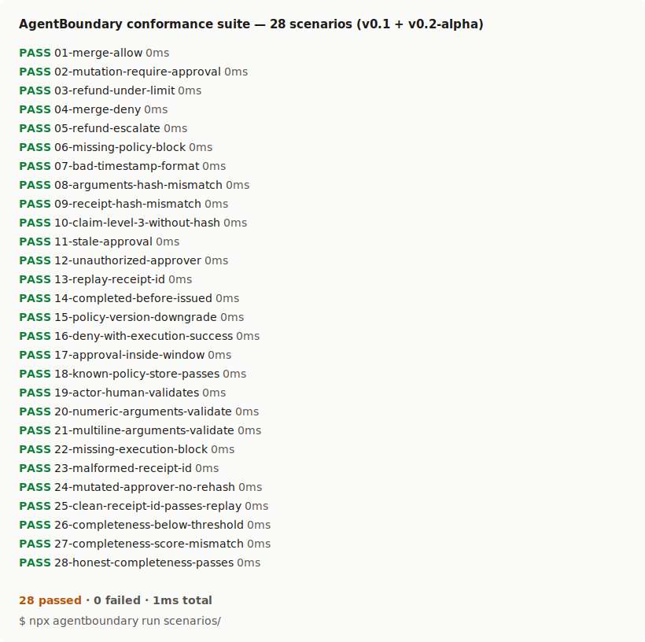

# AgentBoundary

> An open spec and conformance suite for proving AI-initiated production actions.



```bash
npx agentboundary run scenarios/
# or
uvx agentboundary run scenarios/
```

10 scenarios, 60 seconds, no signup, no Docker.

## The problem AgentBoundary solves

Every agent framework can tell you *what an agent did*. None of them lets a third party — auditor, regulator, insurer, the team in the next building — verify *what the agent was allowed to do, by whom, against which policy, with which arguments, with what outcome*, without trusting the framework or model provider.

AgentBoundary defines an **Action Receipt**: a portable, tamper-evident JSON document emitted at the production action boundary (the moment an agent calls a tool that touches reality — merging a PR, refunding a charge, mutating a service). Receipts are content-addressed (`receipt_hash = sha256(canonical_json(receipt))`), bound to the arguments the agent actually executed against (`arguments_hash`), and reference the policy decision (allow / require-approval / deny / escalate) that authorized the action.

The conformance suite in this repo runs ten deterministic scenarios — *every test is named for the failure it prevents* — and grades the receipts they emit against the v0.1 spec at Levels 1, 2, and 3.

## What's in the receipt

```json
{
  "version": "agentboundary/v0.1",
  "receipt_id": "0192c8d0-1f2a-7c3e-bf2a-1a4d3f5e6c7b",
  "issued_at": "2026-06-15T14:23:08Z",
  "actor":  { "type": "agent", "id": "agent:claude-code:session/789abc", "display_name": "Claude Code" },
  "agent":  { "framework": "claude-code", "framework_version": "2.4.1", "model": "claude-opus-4-7" },
  "tool":   { "name": "github-mcp", "version": "0.7.0", "capability": "github.merge" },
  "target": { "system": "github.com/jamjet-labs/agentboundary", "environment": "prod", "resource_id": "pull/14" },
  "arguments_hash": "9698adaf2dca5f26a4f9644a8d0f4f34b5558bce09961f94e810fe3aaa9071aa",
  "policy": { "name": "agentboundary.repo.merges", "version": "2", "decision": "allow" },
  "execution": { "status": "success", "completed_at": "2026-06-15T14:23:09Z", "result_ref": "sha:b1c2d3e4f5a6" },
  "receipt_hash": "4d905d5dbc9faa4dafcb2155da9c4d5e1052cb23c680f3754d4ebc5800a4bae7"
}
```

This is `docs/receipts/github-merge.json` verbatim. The `receipt_hash` is the canonical SHA-256 of the body with `receipt_hash` excluded — recompute it yourself and the value matches.

## What's here today

- [`docs/spec/v0.1.md`](docs/spec/v0.1.md) — the v0.1 specification (definitions, lifecycle, receipt requirements, conformance levels, versioning)
- [`docs/spec/threat-model.md`](docs/spec/threat-model.md) — adversaries, threats, mitigations, and conformance-level mapping
- [`docs/spec/owasp-mapping.md`](docs/spec/owasp-mapping.md) — OWASP LLM Top 10 risks mapped to AgentBoundary conformance levels
- [`docs/schemas/action-receipt-v0.1.json`](docs/schemas/action-receipt-v0.1.json) — Action Receipt JSON Schema (normative source for receipt syntax)
- [`docs/receipts/`](docs/receipts/README.md) — three worked example receipts (GitHub merge, Spring service mutation, Stripe refund); each one's `receipt_hash` verifies under the spec
- [`scenarios/`](scenarios/) — 10 deterministic conformance scenarios driven by `agentboundary run`
- [`src/agentboundary/`](src/agentboundary/) — Python reference implementation (validator, hashing, runtime, CLI)
- [`npm/`](npm/) — thin Node wrapper that dispatches to `uvx`, `pipx`, or `python3 -m agentboundary`

## Run the tests

```bash
pip install hatch
hatch test
```

89 fast tests cover the schema loader, validator, hashing, conformance checks, runtime, scenarios loader, and CLI. 8 additional slow tests verify the published wheel behaves correctly under a clean install.

## Roadmap (this repo, next 12 weeks)

- W1 (done): schema + worked examples + validator
- W2 (done): full spec text in `docs/spec/v0.1.md` + threat model + OWASP mapping
- W3 (done): `agentboundary` CLI runner + first 10 conformance scenarios
- **W4 (now): public launch — spec, schema, conformance suite, microsite at [agentboundary.jamjet.dev](https://agentboundary.jamjet.dev/)**
- W5-W6: reference implementation emits valid Action Receipts for a live production action path; conformance suite expands to 25 scenarios (adversarial: stale approval, mutated arguments after approval, replay, unauthorized approver, policy downgrade, missing receipt, receipt tampering)
- W7-W10: comparative runs mapping the conformance suite onto major agent governance platforms and permission-policy implementations; methodology published before conclusions; right-to-respond windows offered before publication
- W10: conformance suite freezes at 40 scenarios — v0.1 done
- W11-W12: comparative report and teardown video

## License

Apache 2.0 — see [LICENSE](LICENSE).

## Contributing

See [CONTRIBUTING.md](CONTRIBUTING.md). All commits require DCO sign-off (`git commit -s`).

The spec is open. Implementations welcome.
